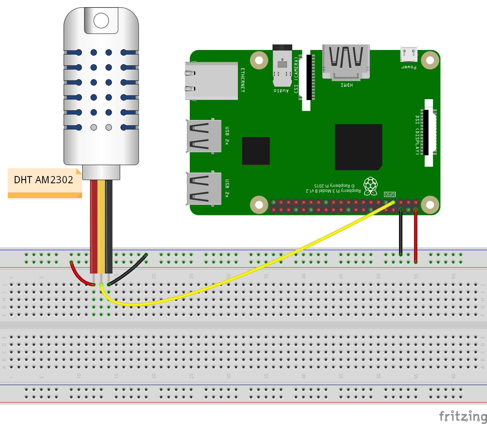

# Kalliope DHT sensor neuron

## Synopsis

Get temperature and humidity from DHT series of humidity and temperature sensors.

Supported sensors are:
- DHT11
- DHT22
- AM2302



## Installation

```bash
kalliope install --git-url https://github.com/Sispheor/kalliope_neuron_dht_sensor.git
```

## Options

| parameter   | required | type    | default | choices              | comment                                                 |
|-------------|----------|---------|---------|----------------------|---------------------------------------------------------|
| sensor_type | YES      | string  |         | DHT11, DHT22, AM2302 | Type of sensor                                          |
| pin         | YES      | integer |         |                      | GPIO pin number (BCM) where the sensor is connected     |
| fahrenheit  | NO       | boolean | FALSE   |                      | If true, the returned temperature will be in fahrenheit |


## Values sent to the synapse

| Name        | Description                                            | Type  | sample |
|-------------|--------------------------------------------------------|-------|--------|
| temperature | the current temperature got from the sensor            | float | 23.8   |
| humidity    | the current percentage of humidity got from the sensor | float | 38.5   |

## Synapses example

Get the temperature and humidity
```yml
- name: "temperature-humidity"
  signals:
    - order: "what is the temperature"
  neurons:
    - dht_sensor:
        sensor_type: "AM2302"
        pin: 17
        say_template: "The temperature is {{ temperature }} degres with {{ humidity }} percents of humidity"
```

Kalliope would answer for example "The temperature is 23.5 degres with 37 percents of humidity"

## Notes

> **Note:** This neuron only work on Raspberry Pi

> **Note:** This neuron can take a while to execute. The module will attempt to read
    multiple times (up to 15) until a good reading can be
    found. If a good reading cannot be found. The delay between retries is 2 seconds
